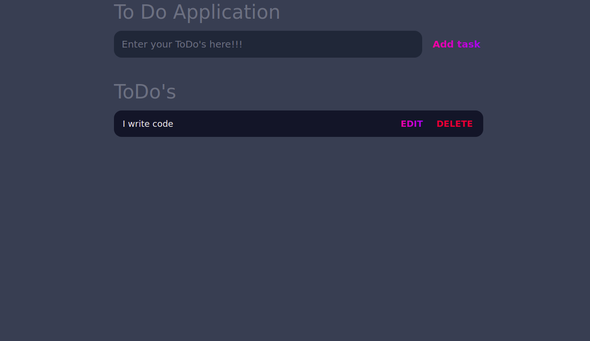
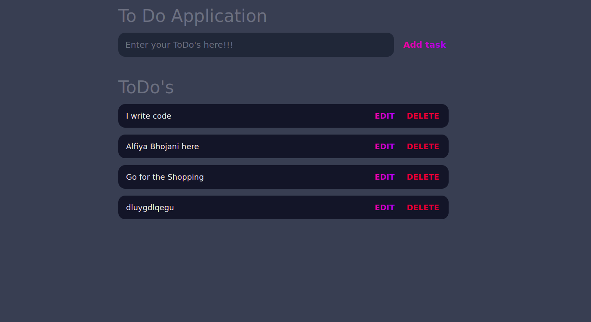
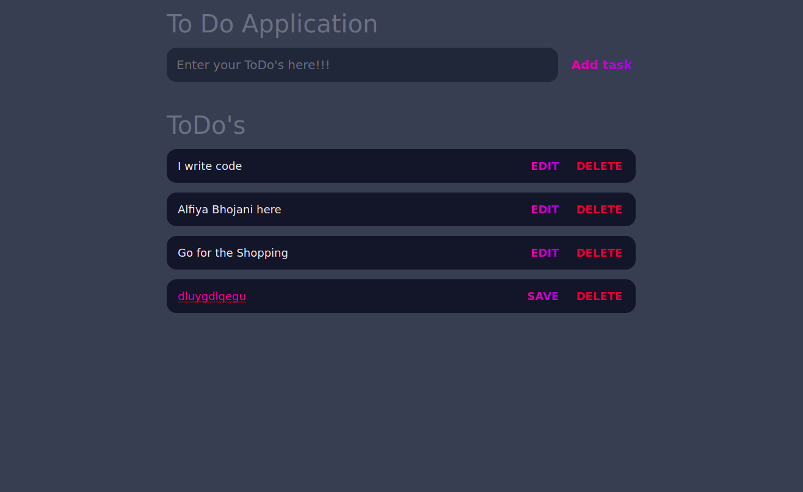
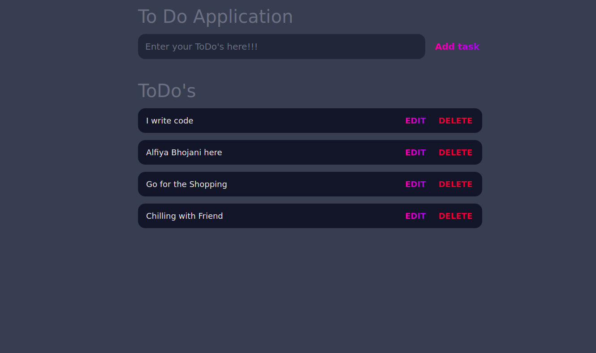
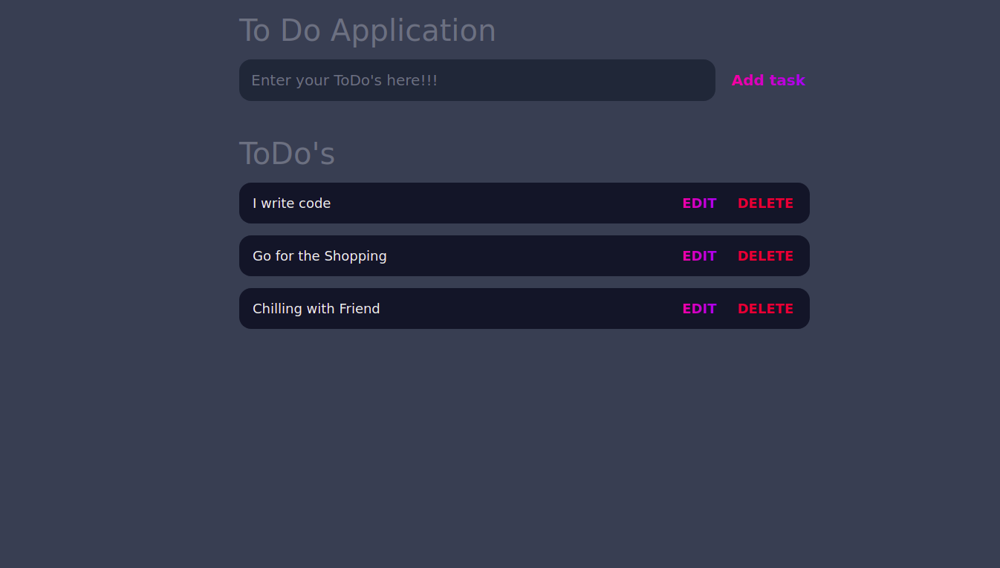

# JAVASCRIPT DOC ASSIGNMENT 07

This is my 7th Javascript Doc Assignment.

This is my To Do Application...

### Output Image

**Tech Used**

- HTML
- CSS
- JAVASCRIPT

### TimeTaken

This Assignment took around 3 hour to complete it...
